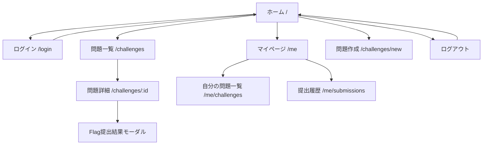
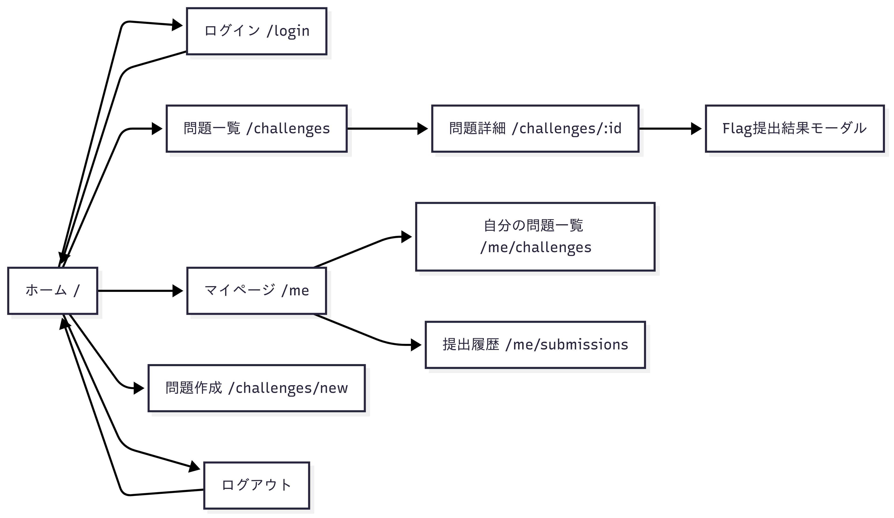

# CTFLab

誰もがCTFの問題を作成し、公開できるアプリ。
webとdesktopで公開する。

技術スタック

| コンポーネント             | 推奨技術                          | 主要な役割・選定理由                                                                 |
|----------------------------|-----------------------------------|----------------------------------------------------------------------------------------|
| バックエンド言語           | Go                                | ユーザー要件。高いパフォーマンスと並行処理性能。                                     |
| バックエンドフレームワーク | Gin                               | 高性能なHTTPルーター、豊富なミドルウェア、広範なコミュニティ。                        |
| デスクトップフレームワーク | Wails                             | Web技術を用いたUI開発、Goとの直接連携、軽量なバイナリ生成。                           |
| フロントエンドフレームワーク | Svelte                            | コンパイラベースによる高速なランタイム性能と軽量なバンドルサイズ。                     |
| データベース               | PostgreSQL                        | 堅牢性、豊富な機能セット（JSONB, 全文検索）、高い信頼性。                            |
| ORM/データアクセス         | GORM                              | 開発効率の向上、マイグレーション機能、豊富な関連付け機能。                             |
| データベースマイグレーション | golang-migrate / Atlas            | バージョン管理された安全なスキーマ変更を実現。                                        |
| API認証                    | JWT (Access + Refresh Tokens)     | ステートレス認証、セキュアなセッション管理。                                          |
| リクエスト検証            | go-playground/validator           | 構造体タグベースの宣言的な入力値検証。                                                |
| 設定管理                  | YAML (Viper)                      | 環境ごとの設定を柔軟に管理。                                                           |
| テスト（バックエンド）     | httptest                          | Go標準ライブラリによるHTTPハンドラの単体テスト。                                      |
| テスト（フロントエンド）   | Vitest + Svelte Testing Library   | Viteネイティブの高速なコンポーネントテスト。                                          |
| デプロイメント             | Docker                            | 環境の再現性とポータビリティを確保。                                                  |

ディレクトリ構成
```text
.
├── cmd
│   └── server
│       └── main.go         # エントリポイント
├── config
│   └── config.go           # 設定（環境変数・DB接続など）
├── internal
│   ├── models
│   │   └── user.go         # ドメインモデル（User等）
│   ├── repository
│   │   └── user_repo.go    # 永続化層（DB）
│   ├── service
│   │   ├── auth_service.go # ローカル認証
│   │   └── oauth_service.go# OAuth認証（gothを使う）
│   ├── handler
│   │   ├── auth_handler.go # /auth/login, register
│   │   └── oauth_handler.go# /auth/github, /auth/google
│   └── router
│       └── router.go       # Ginルーター定義
├── pkg
│   └── token
│       └── jwt.go          # JWT関連ユーティリティ
├── oauth
│   └── init.go             # goth.UseProviders など初期化
├── docs
│   └── swagger...          # Swag用ドキュメント
├── frontend
├── go.mod
├── go.sum
├── main.go                 # redirect to cmd/server/main.go
└── migrations              # DBマイグレーション
```

開発順番
```
Step 1. 機能一覧と画面構成
Step 2. ER図 / GORMモデル作成
Step 3. GinのAPI設計（router + handler）
Step 4. UIモック（SvelteKitで仮組み）
Step 5. API連携
Step 6. Wails統合
```

# Step 1. 機能一覧と画面構成

## MVP
- 認証機能
    - Github / Microsoft アカウントでログイン (OAuth2)
- ユーザー管理
    - 自分のプロフィール閲覧(表示名、問題数など)
    - ログアウト
- 問題作成・管理
    - 問題新規作成(title,description,カテゴリ,flag,添付ファイル)
    - 問題の保存・編集・削除(自分の問題のみ)
    - 問題にDockerベースの環境を添付(例:pwn用コンテナ)
- 問題公開・共有
    - 演題一覧ページ(自作&他人の問題が見える)
    - 問題詳細ページ(description,添付,flag提出用フォーム)
    - 公開・非公開フラグ
- Flag提出・判定
    - 解答フォーム(flag入力→自動判定)
    - 解答履歴(自分がどれを解いたか)
- 管理者・運用視点の最低限機能
    - サンドボックス環境の自動デプロイ(例: `problem.user.ctflab.dev`)
    - 問題ごとに独立したDocker環境を立てる
    - 運用負荷を減らす問題クリーンアップ(いい定時間後自動停止)

## 画面構成(MVP)

```
[ホーム] (/)
 ├─▶ [ログイン] (/login)
 ├─▶ [問題一覧] (/challenges)
 │     └─▶ [問題詳細] (/challenges/:id)
 │           └─▶ [Flag提出結果モーダル]
 ├─▶ [問題作成] (/challenges/new)  ←ログインユーザーのみ
 ├─▶ [マイページ] (/me)
 │     ├─▶ [自分の問題一覧] (/me/challenges)
 │     ├─▶ [解答履歴] (/me/submissions)
 └─▶ [ログアウト]
```




# Step 2. ER図 / GORMモデル

## 📄 users（ユーザー情報）

| Column         | Type         | Description                        |
|----------------|--------------|------------------------------------|
| id             | SERIAL PK    | ユーザーID                         |
| username       | TEXT UNIQUE  | 表示名・サブドメイン用            |
| email          | TEXT UNIQUE  | メールアドレス（認証用）          |
| password_hash  | TEXT         | パスワードのハッシュ               |
| created_at     | TIMESTAMP    | 登録日時                           |

---

## 📄 challenges（問題情報）

| Column         | Type         | Description                        |
|----------------|--------------|------------------------------------|
| id             | SERIAL PK    | 問題ID                             |
| user_id        | INTEGER FK   | 作成者ユーザー                     |
| title          | TEXT         | 問題名（例：fuga）                |
| description    | TEXT         | 問題文（Markdown等）              |
| category_id    | INTEGER FK   | カテゴリ（pwn/web/revなど）       |
| flag           | TEXT         | フラグ（ハッシュ or プレーン）    |
| is_public      | BOOLEAN      | 公開フラグ（trueで他ユーザー表示）|
| score          | INTEGER      | 初期スコア                         |
| created_at     | TIMESTAMP    | 作成日                             |

---

## 📄 challenge_categories（問題カテゴリ）

| Column         | Type         | Description                        |
|----------------|--------------|------------------------------------|
| id             | SERIAL PK    | カテゴリID                         |
| name           | TEXT         | pwn, web, miscなど                 |

---

## 📄 challenge_files（添付ファイル情報）

| Column         | Type         | Description                        |
|----------------|--------------|------------------------------------|
| id             | SERIAL PK    | ファイルID                         |
| challenge_id   | INTEGER FK   | 対応する問題ID                     |
| filename       | TEXT         | 元のファイル名                     |
| filepath       | TEXT         | サーバー内保存パス                 |
| mimetype       | TEXT         | application/zip のみ対応           |
| size           | INTEGER      | サイズ（バイト）                  |
| uploaded_at    | TIMESTAMP    | アップロード日時                   |

---

## 📄 docker_challenges（Docker管理が必要な問題）

| Column         | Type         | Description                        |
|----------------|--------------|------------------------------------|
| id             | SERIAL PK    | Docker情報ID                       |
| challenge_id   | INTEGER FK   | 対応する challenge                 |
| image_tag      | TEXT         | 例：ctflab/bob-hoge:latest         |
| exposed_port   | INTEGER      | 起動時に公開するポート            |
| entrypoint     | TEXT         | 実行エントリポイント               |
| created_at     | TIMESTAMP    | 作成日時                           |

---

## 📄 submissions（ユーザーの提出履歴）

| Column         | Type         | Description                        |
|----------------|--------------|------------------------------------|
| id             | SERIAL PK    | 提出ID                             |
| user_id        | INTEGER FK   | 提出者ユーザーID                   |
| challenge_id   | INTEGER FK   | 対象の challenge                   |
| submitted_at   | TIMESTAMP    | 提出日時                           |
| flag           | TEXT         | 提出された flag                    |
| is_correct     | BOOLEAN      | 正解かどうか                       |

